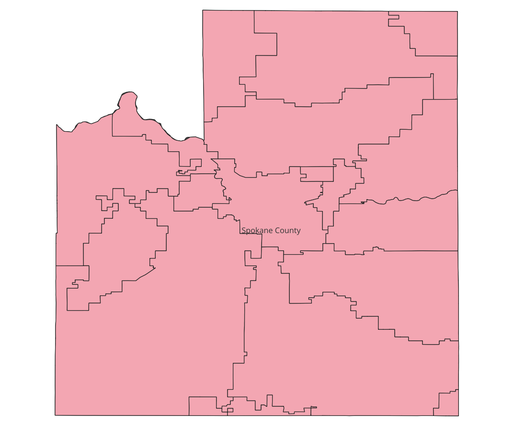

# QGIS Spatial Analysis: Infrastructure Risk Assessment & Geometry Optimization

## Project Objective
This project executes an automated vector analysis workflow to identify administrative boundaries and infrastructure sectors intersecting critical environmental risk zones within Spokane County, Washington. The primary focus of this project is demonstrating advanced data triage, vector troubleshooting, and quantitative data exporting within QGIS.

## Core Technical Competencies Demonstrated
* **Vector Topology Repair:** Successfully identified and resolved structural spatial syntax issues (`Invalid Geometry - Feature Intersection Overlaps`) using the QGIS Vector Geometry processing engine to ensure database mathematical integrity.
* **Spatial Intersection Analysis:** Automated a multi-layer geometric intersection overlay between administrative boundaries and active hazard layers to isolate structural overlap points.
* **Data Triage & Pipeline Exporting:** Extracted processed spatial attribute data vectors into clean, actionable, tabular datasets (`.csv` format) optimized for cross-functional usage.

## Methodological Workflow
1. **Data Ingestion:** Sourced local open-data geographic administrative vectors alongside streamed federal hazard maps.
2. **Topology Maintenance:** Discovered and repaired polygon feature boundary intersection anomalies using the built-in computational geometry engines.
3. **Geoprocessing Execution:** Executed vector overlays (`Intersection`) to synthesize separate layers into a single risk profile.
4. **Data Delivery:** Generated high-resolution cartographic assets alongside structural database spreadsheets.

## Visual Analytics Deliverable
Below is the final cartographic output showing optimized geometric boundaries matching structural county thresholds:

## Processed Data Deliverable
The resulting tabular data showing exact intersections is completely cataloged inside the `spokane_risk_analysis_results.csv` file in this repository.
